<p align="center">
	
</p>
<p align="center">
	<strong>适合互联网企业使用的开源智慧党建云平台</strong>
</p>
<p align="center">
	👉 <a href="https://www.scmintu.com/">https://www.scmintu.com/</a> 👈
</p>

<p align="center">
	<a target="_blank" href="https://spring.io/projects/spring-boot">
		
	</a>
    <a target="_blank" href="https://www.oracle.com/java/technologies/javase/javase-jdk11-downloads.html">
		
	</a>
	<a target="_blank" href="http://www.gnu.org/licenses/lgpl.html">
		
	</a>
</p>


-------------------------------------------------------------------------------

## 📚 项目介绍

SmartPartyBuilding是一套适合市、区、街道、园区等各级党政机关、企业、院校、医疗等机构等机构使用的开源智慧党建云平台，智慧党建云平台采用多租户模式构建数字党建新模式，采用微应用架构满足可扩展功能，市场落地案列多成熟稳定。
此项目是后端工程（数据库没开源，如果需要商用、演示或者试用请联系我们）


## 🍎 项目特点

* 多租户模式构建数字党建新模式
* 采用微应用架构满足可扩展功能
* 使用`sofa boot`框架作为后端框架，便于维护
* 接口请求和响应数据采用签名机制，保证交易安全可靠
* 管理平台操作界面简洁、易用
* 使用`spring security`实现权限管理
* 前后端分离架构，方便二次开发

## 🍟 项目体验
- 智慧党建云平台：[https://scmintu.com/](https://scmintu.com/ "（公司官网查看）智慧党建云平台")

## 🥞 系统架构

> 开源智慧党建云平台架构图


> 核心技术栈

| 软件名称  | 描述 | 版本
|---|---|---
|Jdk | Java环境 | 1.11
|Spring Boot | 开发框架 | 2.4.5
|Redis | 分布式缓存 | 3.2.8 或 高版本
|MySQL | 数据库 | 5.7.X 或 8.0 高版本
|[Iview Ui](http://iview.talkingdata.com/) | iview Vue框架，前端开发使用 | 4.7.0
|[MyBatis-Plus](https://mp.baomidou.com/) | MyBatis增强工具 | 3.4.2
|[Hutool](https://www.hutool.cn/) | Java工具类库 | 5.6.6

> 项目结构（前后端分离了的，可以分明查看）

```lua

SmartPartyBuilding
├──dj-server-dwgl -- 党务管理后端
├──dj-ui-app-- 手机端
├──dj-ui-dwgl -- 党务管理前端
├──dj-ui-go-view -- 大屏前端
├──dj-ui-honor -- 荣誉管理
├──dj-ui-lesson -- 学习管理
├──dj-ui-message -- 短信管理
├──dj-ui-tzgl -- 统战管理
├──dj-fastcmscms -- cms系统
├──dj-portal -- 门户
├──dj-survey -- 投票问卷(前后端)
├──dj-xfzb -- 先锋指标(前后端)
├──go-wew-seme -- 大屏后端
├──party-paas-all-in-one-online -- 网关相关
└── vx_images -- 项目截图
```


## 🍿 功能介绍
1.党务管理平台（含组织管理、党员管理、三会一课管理、党费缴纳管理、党建新闻、荣誉管理、学习积分管理、投票问卷管理、大数据分析、党建AI助手）；
2.党建移动端（含我的支部、我的荣誉、个人积分、党费缴纳代缴、三会一课、党建咨询图文、视频）

> 功能结构图
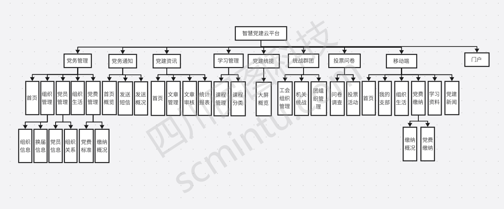

## 🍯 系统截图

`以下截图是从实际已完成功能界面截取,截图时间为：2024-08-29 08:59`
### 1、登录页面

### 2、首页
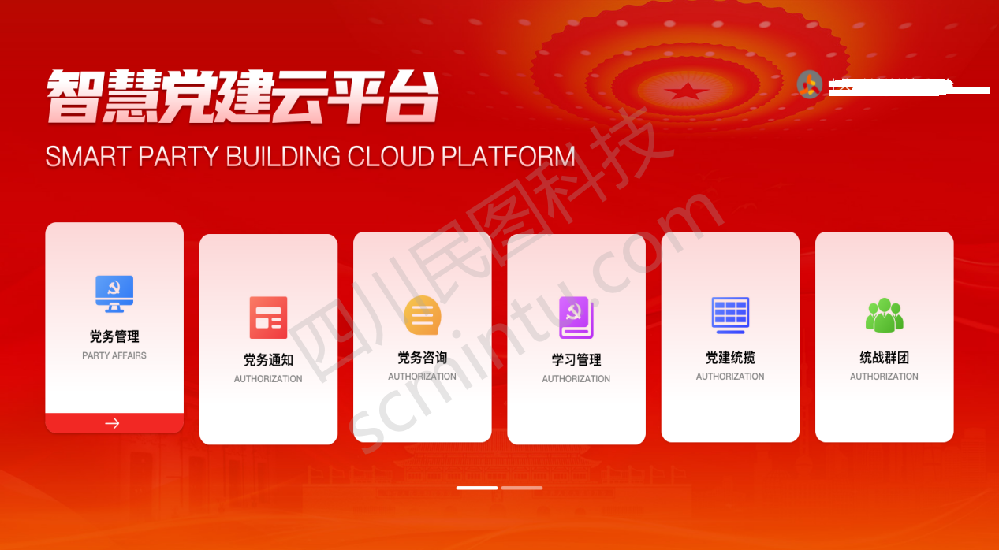
### 3、组织管理

组织详情
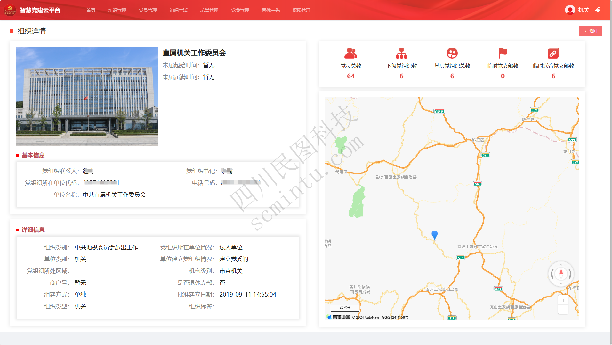
### 4、组织生活
组织生活概况

组织生活详情


### 5、党费管理

缴纳信息
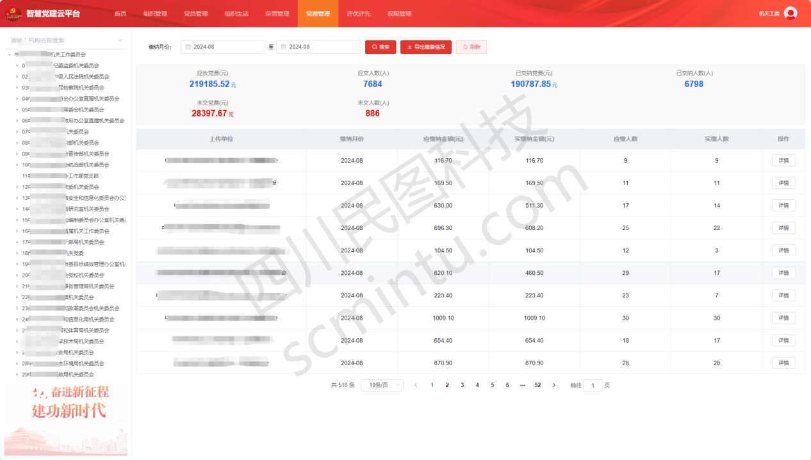


### 6、党员管理
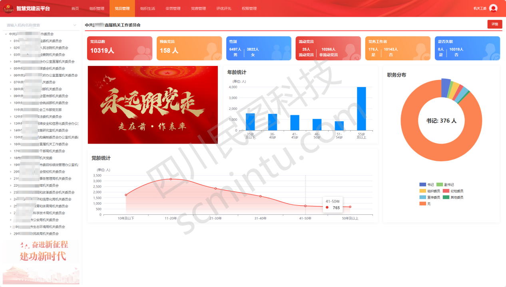
党员画像
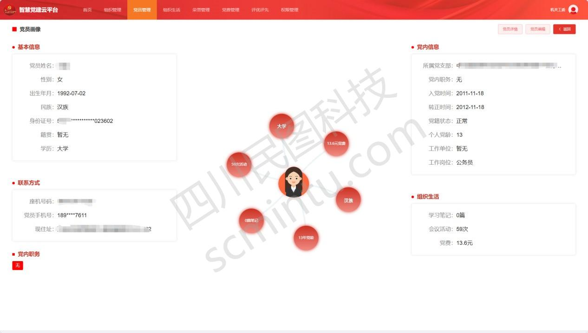
### 7、党建新闻
新闻记录

新闻详情

新闻发布概况统计

### 8、投票问卷
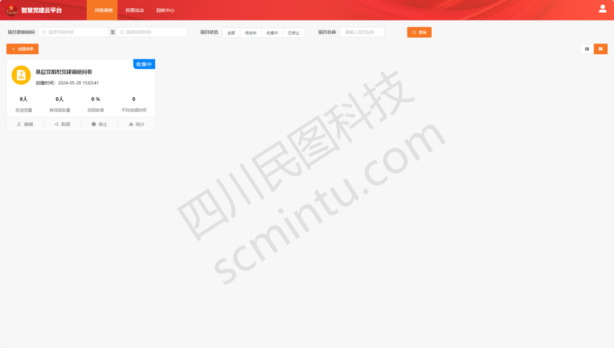

创建问卷调查
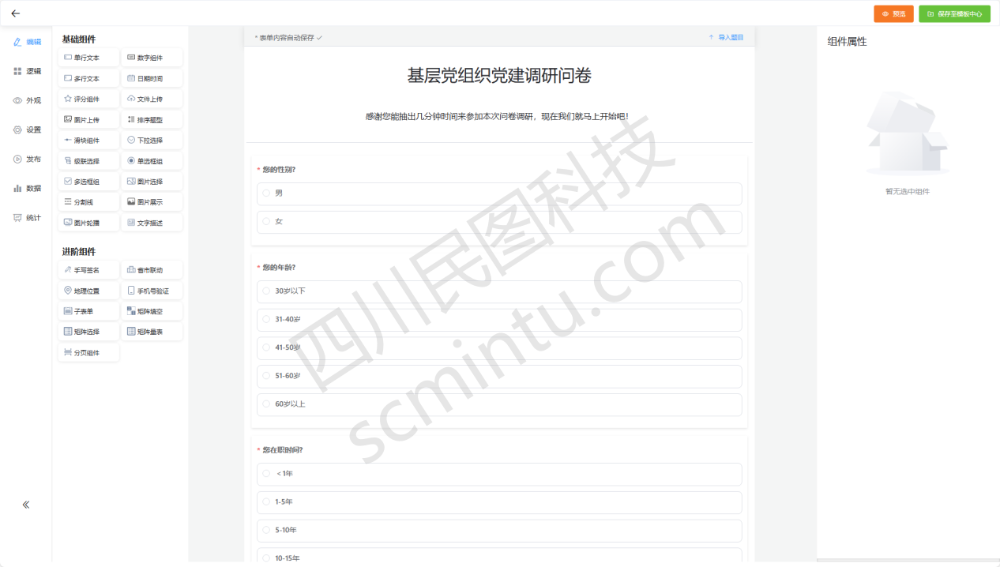


问卷发布


### 9、短信管理
自定义短信发送
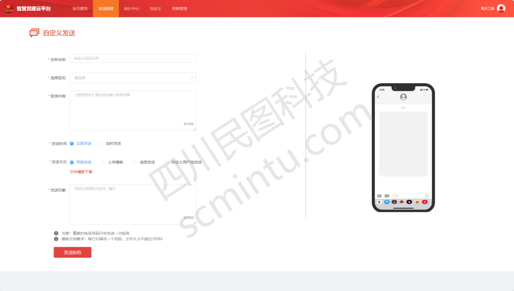
自定义短信发送用户组

### 10、大屏


### 11、门户

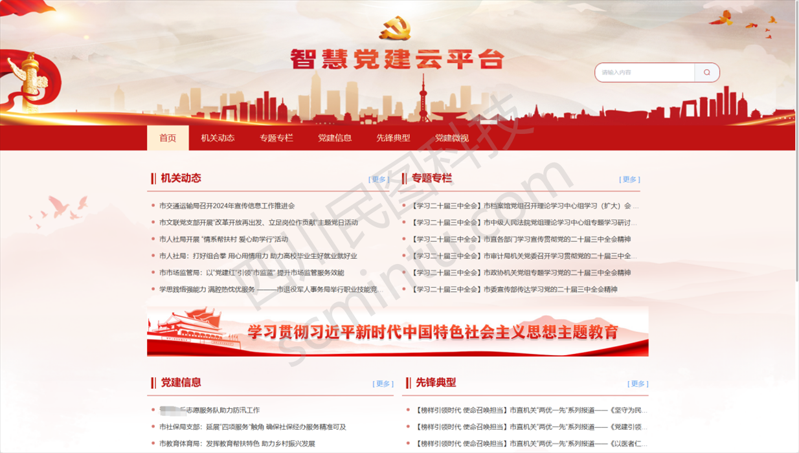


### 12、手机端
 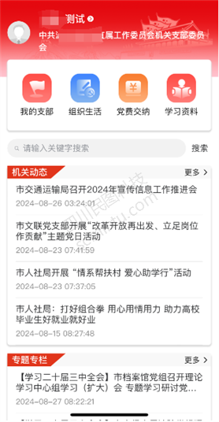         


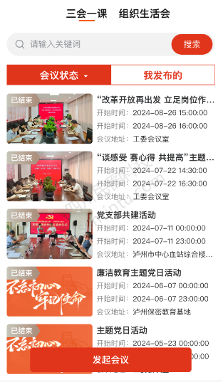        


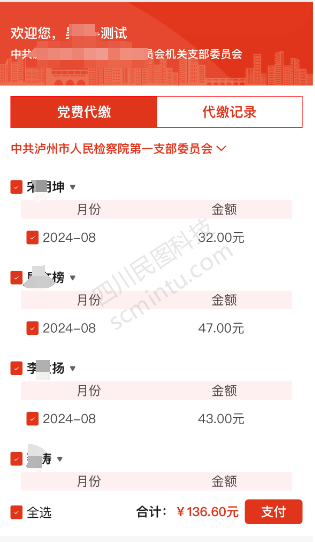


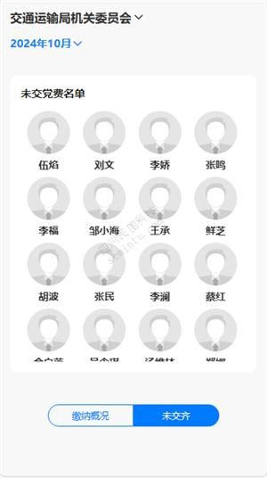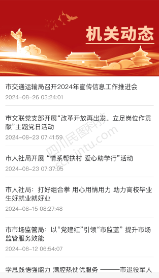


## 开源版使用须知
***
* 需标注"代码来源于四川民图科技开源项目"后即可免费自用运营
* 前端运营时展示的内容不得使用四川民图科技相关信息
* 允许用于个人学习、教学案例
* 开源版不得直接倒卖源码
* 禁止将本项目的代码和资源进行任何形式的出售，产生的一切任何后果责任由侵权者自负

## 商业合作
***
*  如果你想使用功能更完善的党建系统，请联系微信客服: 188 2843 5277 获取专业版
*  如果您想基于党建系统进行定制开发，我们提供有偿定制服务支持！
*  其他合作模式不限，欢迎来撩！
*  联系我们（商务请联系电话：188 2843 5277）

## 🥪 关于我们
***
* 公司名称：四川民图科技有限公司
* 地址：成都市金牛区北三环路一段221号
* 电话：400-855-2332
* 业务合作：scmtkj@163.com
* 公司主页：https://www.scmintu.com/


